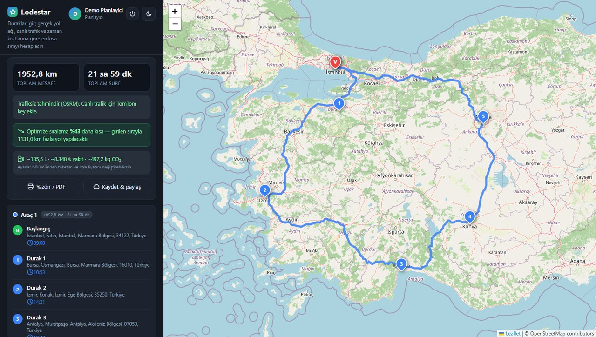
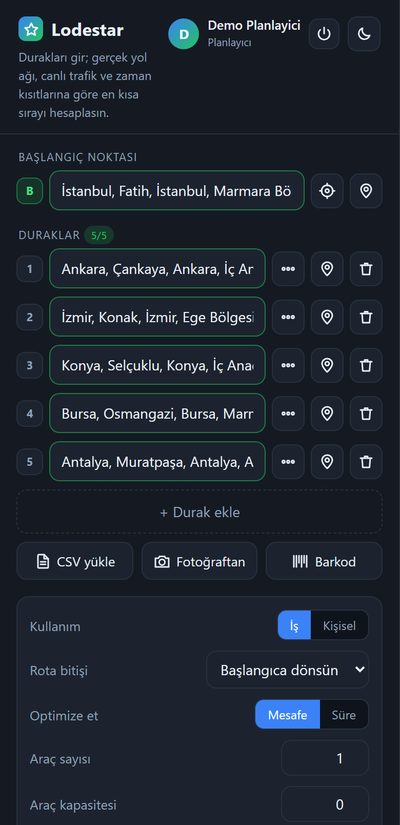
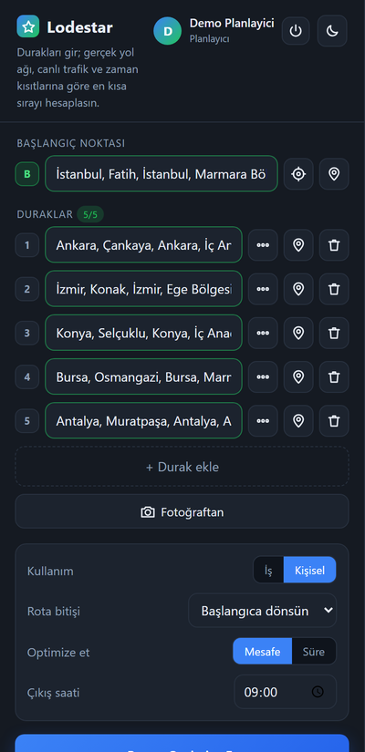
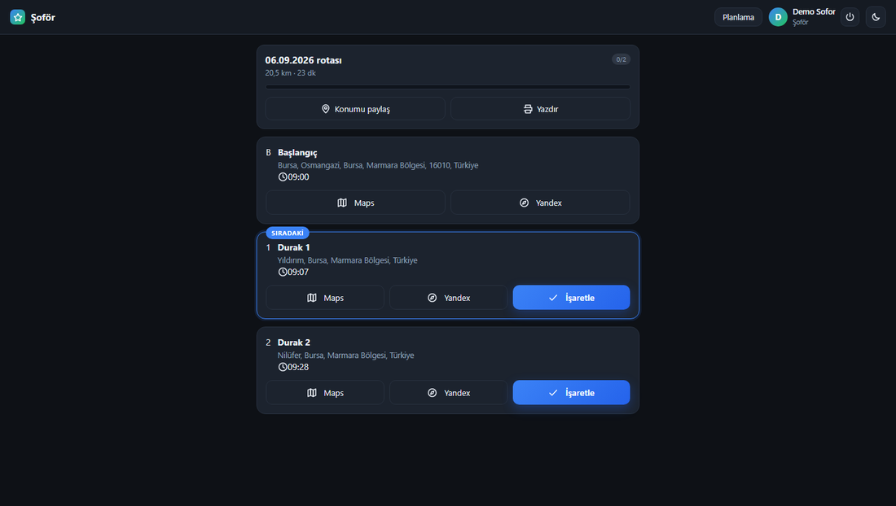

# Lodestar

**Çok duraklı rota optimizasyonu.** Tarayıcıda çalışır, kurulum istemez.

Gideceğin yerleri girersin; uygulama en kısa ziyaret sırasını hesaplar, rotayı gerçek yol
ağı üzerinden çizer, canlı trafiği hesaba katar ve varış saatlerini verir.

Kurye, nakliyeci ya da sadece birkaç şehir dolaşacak bir sürücü — hepsi kullanabilir.
Uygulama açılışta hangisi olduğunu sorar ve ekranı ona göre sadeleştirir.

**Canlı demo: https://omer1916.github.io/lodestar/**



*İstanbul çıkışlı beş şehirlik tur. Girilen sırayla 1.131 km fazla yol yapılacaktı;
optimize edilmiş sıra %43 daha kısa.*

---

## Ne işe yarar

"Şu noktalara gideceğim, hangi sırayla gitmeliyim?" sorusu göründüğünden pahalı. Elle
sıralanan rotalarda ölçtüğüm fark %20-31 arasında değişti. Lodestar sıralamayı
hesaplar ve farkı ekranda gösterir:

> Optimize sıralama **%31 daha kısa** — girilen sırayla 9,4 km fazla yol yapılacaktı.
> ~2,8 L · ~128 ₺ yakıt · ~7,6 kg CO₂

Ölçek fark etmiyor. Şehir içi 15 duraklı bir kurye turu da, İstanbul çıkışlı
Bursa-İzmir-Antalya-Konya-Ankara turu da aynı problem: ikincisinde elle sıralama
**425 km fazla yol**, yaklaşık 1.800 ₺ fazladan yakıt demek.

Sadece "en kısa yol" değil; kapasite, teslim saatleri ve vardiya süresi gibi gerçek
kısıtları da hesaba katar.

### Kimin işine yarar

| | |
|---|---|
| **Kargo ve kurye** | Günlük teslimat listesi, çoklu araç dağıtımı, teslim saatleri, teslimat takibi |
| **Nakliye ve kamyon** | Şehirler arası yükleme-boşaltma turu, durak başına yük, kapasite, yakıt gideri |
| **Kendi yolunu planlayan sürücü** | Gideceği yerlerin en kısa sırası, canlı trafik, varış saatleri, navigasyon |
| **Şoför ve saha ekibi** | Sıralı durak listesi, navigasyon linkleri, teslimat işaretleme, konum paylaşımı |

### İki farklı ekran

Hepsi aynı uygulamayı kullanır ama aynı ekrana ihtiyaçları yok. Kamyoncunun kapasite
alanına ihtiyacı var, hafta sonu gezisi planlayan sürücünün yok. Kayıt sırasında önce
**İş mi Kişisel mi** diye sorulur; iş seçilirse ayrıca **Planlayıcı mı Şoför mü**
belirtilir. Kişisel kullanıcıya planlayıcı/şoför sorusu hiç sorulmaz — kendi gezisini
planlayan biri için anlamı yok. Ekran buna göre kurulur:

| | İş modu | Kişisel mod |
|---|:---:|:---:|
| Durak girişi, haritadan seçme, sürükle-bırak sıralama | var | var |
| En kısa sıra, gerçek yol rotası, canlı trafik | var | var |
| Varış saatleri, yakıt maliyeti, CO₂ | var | var |
| Zaman aralığı ("17:00'den önce orada ol") | var | var |
| Adres defteri, rota geçmişi, paylaşım linki, navigasyon | var | var |
| Araç sayısı ve araç kapasitesi | var | **yok** |
| Vardiya süresi ve ertesi güne aktarma | var | **yok** |
| Durak başına yük | var | **yok** |
| Müşteri telefonu ve WhatsApp ETA mesajı | var | **yok** |
| CSV ve barkod ile toplu durak girişi | var | **yok** |
| Şoföre atama, teslimat takibi, teslimat kanıtı | var | **yok** |

| İş modu | Kişisel mod |
|---|---|
|  |  |

Zaman aralığı kişisel modda da duruyor: gezen sürücünün de "müze 17:00'de kapanıyor"
demeye ihtiyacı var.

İşin asıl kısmı alanları gizlemek değil, **hesaba katmamak**. Kişisel modda araç sayısı
1'e, kapasite ve vardiya 0'a sabitlenir. Aksi halde iş modunda girilmiş bir "3 araç"
değeri, alan görünmez olduğu halde özel bir geziyi üç araca bölerdi.

Seçim hesaba yazılır ve planlama ekranındaki **Kullanım** satırından her an
değiştirilebilir. Şoför hesabıyla girene planlama yerine kendi **Rotalarım** ekranı
açılır; iki ekran birbirine linkli, hiçbiri çıkmaz sokak değil.

---

## Özellikler

### Rota optimizasyonu
- Nearest-neighbor + **2-opt** yerel arama ile durak sıralama
- 12+ durakta **simulated annealing** (tavlama benzetimi) devreye girer — ölçümlerde
  2-opt sonucunu ortalama **%3,85** daha kısaltıyor
- **Sweep algoritması** ile çoklu araç dağıtımı (depo etrafında açısal tarama + kapasite)
- Sıralama, TomTom Matrix Routing v2 ile gerçek yol mesafesine göre yapılır (anahtar varsa)

### Lojistik kısıtları
- **Araç kapasitesi** — durak başına yük, kapasite dolunca sonraki araca aktarılır
- **Zaman penceresi** — "09:00-11:00 arası teslim"; gecikme riski olan duraklar işaretlenir
- **Vardiya süresi** — aşan duraklar tek tıkla ertesi güne aktarılır
- Her durak için tahmini varış saati (ETA)

### Trafik
- TomTom anahtarı varsa rota **canlı trafiğe göre** hesaplanır; yoğun yollardan kaçınır
- **Yoğunluk haritada renklenir** — sarı (hafif), turuncu (orta), kırmızı (yoğun),
  koyu kırmızı (durma/kapalı). Tıklayınca gecikme ve ortalama hız görünür
- "Mesafe" seçilirse en kısa yol, "Süre" seçilirse en hızlı yol istenir
- Anahtar yoksa ücretsiz OSRM ile trafiksiz gerçek yol rotası çizilir

### Canlı yeniden rotalama
Şoför yoğun bir tıkanıklığa **2 km kala** alternatif yol taranır — trafiğe girmeden,
hâlâ sapma şansı varken. Kayda değer kazanç varsa ekranda öneri çıkar.

Kota dostu tetikleme: yalnızca kırmızı ve üzeri tıkanıklıklar sayılır, aynı tıkanıklık
bir kez taranır, en az 3 dk ara ve 700 m ilerleme gerekir, günlük 60 tarama tavanı vardır.
Yedek tetikleyici anlık hıza değil **5 dakikada kat edilen yola** bakar — böylece kırmızı
ışıkta boşuna tarama yapılmaz.

### Veri girişi
- Adres araması (OpenStreetMap Nominatim) + otomatik tamamlama
- Haritadan tıklayarak seçme, pinleri sürükleyerek taşıma
- **CSV içe aktarma** — adres, yük, telefon ve zaman penceresi sütunlarıyla
- **Fotoğraftan adres okuma (OCR)** — teslimat listesinin fotoğrafından satırları çıkarır
- **Barkod / QR okuma** — paket etiketinden durak ekleme
- **Adres defteri** — sık gidilen noktaları kaydet, tek tıkla ekle
- Durakları **sürükle-bırak** ile elle sıralama (dokunmatikte de çalışır)

### Hesaplar ve roller
- Firebase Auth ile e-posta/şifre kaydı ve giriş, şifre sıfırlama
  (Google girişi kodda hazır, konsoldan açılınca tek satırla etkinleşir)
- Kayıtta **planlayıcı / şoför** rolü seçimi
- Rotalar hesaba bağlı saklanır — telefondan da bilgisayardan da aynı liste

### Şoför ekranı



- Kendisine atanan rotalar listesi
- Sıralı durak listesi, sıradaki durak vurgusu, ETA
- Tek dokunuşla **Google Maps / Yandex Navigasyon**, müşteriye **WhatsApp** ETA mesajı
- **Teslim edildi / edilemedi** işaretleme: sebep, not ve **fotoğraflı teslimat kanıtı**
- Konum paylaşımı — merkez şoförü haritada canlı görür
- Hesapsız da çalışır: paylaşılan şoför linki yeterli

### Paylaşım ve takip
- **Takip linki** — müşteri/ekip rotayı salt-okunur görür
- **Canlı teslimat ilerlemesi** — X/Y teslim, durak durum etiketleri, anlık güncellenir
- **Yazdırılabilir teslimat listesi** (imza sütunlu; tarayıcının "PDF olarak kaydet"i ile PDF)
- **Özet sayfası** — toplam rota/km/durak, teslim başarı oranı, zaman penceresi uyumu, yakıt gideri

### Arayüz
- Tanıtım sayfası + planlama uygulaması + şoför ekranı + takip + özet
- **İş / kişisel mod** — kişisel modda filo ve teslimat alanları hem gizlenir hem de
  hesaba katılmaz
- Açık/koyu tema, tamamen mobil uyumlu
- **PWA** — telefona kurulabilir, çevrimdışı açılır
- Emoji yerine satır içi SVG ikonlar (her platformda aynı görünür)

---

## Teknoloji

| Katman | Kullanılan |
|---|---|
| Arayüz | Vanilla JS (ES5 uyumlu), CSS değişkenleriyle tema, bağımlılıksız modüler yapı |
| Harita | Leaflet + OpenStreetMap |
| Rota / trafik | TomTom Routing API (canlı trafik), OSRM (ücretsiz yedek) |
| Mesafe matrisi | TomTom Matrix Routing v2 |
| Geocoding | Nominatim (OpenStreetMap) |
| OCR | Tesseract.js (tamamen istemci tarafında) |
| Barkod | BarcodeDetector API + jsQR (yedek) |
| Backend | Firebase Firestore + Firebase Auth |
| PWA | Web App Manifest + Service Worker |

**Build aracı, paket yöneticisi, derleme adımı yok.** Statik dosyalar; herhangi bir yere
kopyalayınca çalışır.

---

## Güvenlik

Firestore güvenlik kuralları [`firestore.rules`](firestore.rules) dosyasında ve
**14 saldırı senaryosuyla canlı test edilmiştir**:

- Kullanıcı profilleri ve adres defteri yalnızca sahibine açık
- Rotalar sahibine ve atanan şoföre açık; paylaşım linkiyle **tek doküman** okunabilir
  ama koleksiyon **listelenemez** — bu ayrım olmadan tüm veritabanı dökülebiliyordu
- Teslimat kaydı silmek yalnızca rota sahibinde: kanıt yok edilemez
- Teslimat kayıtlarında alan listesi, durum değeri ve boyut doğrulaması
- Konum güncellemelerinde tip ve enlem/boylam aralığı kontrolü
- Rota sahipliği güncellemede kilitli

**Bilinçli tasarım tercihi:** şoför linkini bilen kişi konum paylaşabilir ve teslimat
işaretleyebilir. Hesabı olmayan kuryelerin çalışabilmesi için böyledir — link burada
bir tür anahtardır, ilgisiz kişilere gönderilmemelidir.

---

## Kapsam notu

Optimizasyon gerçek bir VRP/VRPTW çözücüsü değil, **sezgisel (heuristic)** bir
yaklaşımdır: kapasite greedy olarak doldurulur, zaman pencereleri yumuşak kısıt olarak
maliyet fonksiyonuna eklenir. Pratikte çok iyi sonuç verir; matematiksel olarak "kesin en
iyi" olduğu garanti edilmez. Sıralamayı sürükleyerek elle de değiştirebilirsin.

---

## Proje yapısı

```
lodestar/
├── index.html             # tanıtım / kapak sayfası
├── app.html               # planlama ekranı
├── driver.html            # şoför ekranı (rota, navigasyon, teslimat, konum)
├── view.html              # paylaşılan rota (salt okunur + canlı takip)
├── stats.html             # rota özeti / analitik
├── kurulum.html           # nasıl kullanılır kılavuzu
├── firestore.rules        # güvenlik kuralları (konsola yapıştırılır)
├── firestore.indexes.json # bileşik indeks tanımları
├── css/style.css          # tema değişkenleri, bileşenler, yazdırma stilleri
├── js/
│   ├── firebase-config.js # Firebase projesi (gizli değil)
│   ├── icons.js           # satır içi SVG ikon seti
│   ├── mode.js            # iş / kişisel kullanım modu
│   ├── geo.js             # geocoding, reverse geocoding, haversine
│   ├── optimize.js        # nearest-neighbor, 2-opt, tavlama, sweep, zaman penceresi
│   ├── routing.js         # OSRM + TomTom rota, trafik bölümleri, mesafe matrisi
│   ├── reroute.js         # canlı yeniden rotalama ve kota koruması
│   ├── storage.js         # Firestore: kayıt, geçmiş, paylaşım, atama, teslimat
│   ├── auth.js            # Firebase Auth sarmalayıcı, roller
│   ├── auth-ui.js         # giriş/kayıt modalı, oturum göstergesi
│   ├── delivery.js        # teslimat durumu, fotoğraf sıkıştırma, navigasyon linkleri
│   ├── importers.js       # CSV ayrıştırma
│   ├── ocr.js             # Tesseract.js ile fotoğraftan adres
│   ├── scanner.js         # barkod / QR okuma
│   ├── pdf.js             # yazdırılabilir teslimat listesi
│   └── app.js             # arayüz ve akış yönetimi
├── manifest.json          # PWA
└── sw.js                  # service worker
```

---

## Lisans

MIT
